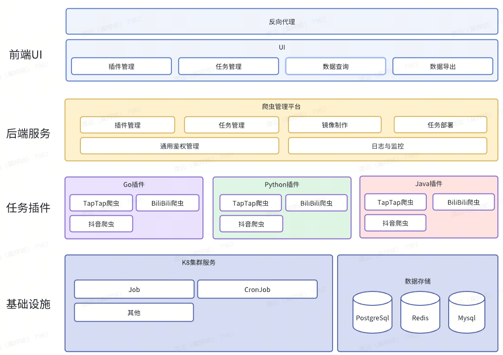

# 爬虫项目说明文档
## 一、项目概述
本项目是一个名为 crawler 的爬虫项目，具备数据抓取、存储、部署以及持续集成与部署等功能。使用了 Go 和 Python 语言编写，借助 GORM 与 PostgreSQL 数据库交互，运用 Scrapy 和 Colly 框架进行数据抓取，通过 Kubernetes 进行部署，并利用 GitHub Actions 实现 CI/CD。

## 二、项目结构


### 主要目录说明
1. infrast/persistence ：数据持久化相关代码，使用 GORM 与 PostgreSQL 数据库交互，实现数据的增删改查操作。
2. domain/entity ：定义项目中的实体类，如 JobRecord 和 DataRecord ，对应数据库表结构。
3. plugins ：存放不同语言编写的爬虫插件，包括 Python 和 Go 语言编写的爬虫代码。
   - plugins/python/python_scrapy ：使用 Scrapy 框架编写的 Python 爬虫，用于抓取哔哩哔哩等网站的数据。
   - plugins/go/myColly ：使用 Colly 框架编写的 Go 语言爬虫，实现数据抓取功能。
4. deploy ：包含 Kubernetes 部署相关代码，可在 Kubernetes 集群中部署爬虫任务。
5. bat ：包含一些部署和配置脚本及 YAML 文件，如 PostgreSQL 和 NocoBase 的部署配置。
6. build/ci ：包含 CI 配置文件（ ci.yaml ），使用 GitHub Actions 实现代码的构建和测试。
7. build/cd ：包含 CD 配置文件（ cd.yaml ），使用 GitHub Actions 实现代码的部署。
8. docs ：包含 Swagger 生成的 API 文档（ swagger.json ）和相关代码文件，描述项目的 API 接口。
## 三、环境准备
### 开发环境
- Go 语言环境（版本 1.16 及以上）
- Python 环境（版本 3.x）
- PostgreSQL 数据库
- Docker 环境
- Kubernetes 集群（可选，用于部署）
### 依赖安装
- Go 依赖：在项目根目录下执行 go mod tidy 安装 Go 依赖。
- Python 依赖：在 plugins/python/python_scrapy 目录下执行 pip install -r requirements.txt 安装 Python 依赖。
## 四、项目启动
### 本地开发
1. 配置数据库连接信息，在 conf 目录下的配置文件中修改数据库连接参数。
2. 启动数据库服务。
3. 在项目根目录下执行 go run main.go 启动项目。
### 容器化部署
1. 构建 Docker 镜像：在项目根目录下执行 docker build -t crawler:latest .
2. 打标签docker tag  crawler:latest default.registry.tke-syyx.com/syyx-tpf/crawler:1.0.67
2. 推送 Docker 镜像到镜像仓库：执行 docker push crawler:latest default.registry.tke-syyx.com/syyx-tpf/crawler:1.0.67
3. 在 Kubernetes 集群中部署项目：使用 deploy 目录下的 YAML 文件进行部署，例如 kubectl apply -f deployment_pro.yaml
## 五、持续集成与部署（CI/CD）
### CI
当代码推送到 main 分支或发起 Pull Request 到 main 分支时，GitHub Actions 会自动触发 build-and-test 任务，执行代码构建和测试操作。配置文件位于 build/ci/ci.yaml 。

### CD
当代码推送到 main 分支时，GitHub Actions 会自动触发 deploy 任务，将代码部署到指定服务器。配置文件位于 build/cd/cd.yaml 。

## 六、快速开始
1.
2.创建数据库：使用/bat/crawler_data.sql创建爬虫数据库


## 六、数据库导出导入
### 正式环境到开发环境
```bash
(D:\pgAdmin 4\runtime\).\pg_dump.exe --file "C:\\Users\\huangziming\\Documents\\prod_to_dev" --host "10.100.16.111" --port "5432" --username "postgres" --format=c --blobs --verbose "crawler"
(D:\pgAdmin 4\runtime\).\pg_restore.exe --host "10.100.0.220" --port "5432" --username "postgres" --dbname "crawler" --verbose "C:\\Users\\huangziming\\Documents\\prod_to_dev"
 ```
```

### 开发环境到正式环境
```bash
(D:\pgAdmin 4\runtime\).\pg_dump.exe --file "C:\\Users\\huangziming\\Documents\\dev_to_prod" --host "10.100.0.220" --port "5432" --username "postgres" --format=c --blobs --verbose "crawler"
(D:\pgAdmin 4\runtime\).\pg_restore.exe --host "10.100.16.111" --port "5432" --username "postgres" --dbname "crawler" --verbose "C:\\Users\\huangziming\\Documents\\dev_to_prod"
 ```
```

## 七、注意事项
- 确保数据库服务正常运行，并且配置文件中的数据库连接信息正确。
- 在使用 Kubernetes 部署时，确保集群环境正常，并且有足够的资源。
- 在使用 CI/CD 功能时，确保 GitHub Actions 的配置正确，并且有相应的权限。